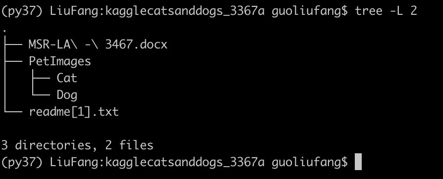

# pytorch_alexnet

### Pytorch implemention of AlexNet

### Prerequisites

- Python >= 3.5

```shell
pip install -r requirements.txt -i https://mirrors.163.com/pypi/simple/
```

### DataSet

Using Kaggle Dogs vs. Cats

https://www.kaggle.com/c/dogs-vs-cats/data

or

DataSet Directories:



### TensorBoard

```
tensorboard --logdir=runs
```


### Reference

[caffe alexnet](https://github.com/BVLC/caffe/tree/master/models/bvlc_alexnet)

[ImageNet Classification with Deep Convolutional Neural Networks](http://www.cs.toronto.edu/~kriz/imagenet_classification_with_deep_convolutional.pdf)

[alexnet-pytorch](https://github.com/dansuh17/alexnet-pytorch)


